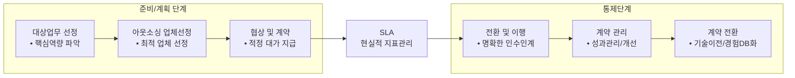

<!-- PDF page: 058 -->

#### 나) 도입 프로세스

[그림 21] IT 비즈니스 아웃소싱 도입 프로세스 개념도

아웃소싱을 도입하기 위해서는 먼저 자사의 핵심역량을 파악하여 위탁할 대상업무를 선정하는 것으로 시작된다. 대상
업무가 선정되면 업체를 선정하고 협상과 계약을 하게 되는데, 이 때 중요한 것은 서비스 수준에 대한 명확한 지표관리
및 합의6 가 필요하다.

#### 다) 아웃소싱의 형태

IT 비즈니스 아웃소싱의 형태는 크게 4개로 구분된다.
〈표 18〉 IT 비즈니스 아웃소싱의 형태

| 형태 | 설명 |
| --- | --- |
| 전체 아웃소싱(Total Outsourcing) | IT 기능 전체를 하나의 벤더에게 전부 위탁하는 형태이며 책임소재가 명확하고 업무효율성을 증대할 수 있으나 경쟁부재에 따른 독점적 문제가 부각될 수 있다. |
| 선택적 아웃소싱(Selective Outsourcing) | 선택된 기능 또는 업무단위를 여러 벤더에게 위탁하는 형태이며 경쟁으로 인한 가격과 품질측면의 향상을 기대할 수 있으나 문제발생 시 책임소재에 대한 문제와 고객의 요구사항이 정확하게 전달되는 것에 어려움이 있다. |
| IT 자회사 아웃소싱(IT subsidiary company Outsourcing) | IT 전문법인을 별도로 설립하고 아웃소싱하는 형태이며, 동료의식으로 인한 단결과 의사소통향상을 기대할 수 있다. 그러나 관련비용이 증가할 수 있고, 수익성이 확보되지 않았을 경우 모회사에게도 위험요소로 작용할 수 있다. |
| 코 소싱(Co-Sourcing) | IT 기획 및 전략과 IT 서비스 수행을 분리하는 형태로 급변하는 환경에 대응하기 유리한 형태이고 Total Outsourcing의 문제점을 부분적으로 해결할 수 있다. 다만, 전략과 수행의 갭(Gap)이 발생할 경우 다양한 조율이 필요할 수 있다. |

#### 라) 아웃소싱 도입에 따른 고려사항

IT 아웃소싱을 추진하고자 할 때 다양한 문제점을 만나게 된다. 이러한 문제점을 해결하기 위하여 다음과 같은 고려사항
을 확인할 수 있다.
IT 아웃소싱을 수행할 시에는 아웃소싱 벤더(업체)에 대한 지속적 관리가 필요하고, 관리를 위한 표준으로 eSCM7과 ISO/
IEC20000 등의 표준을 활용할 수 있다.

6 서비스 수준에 대한 명확한 지표관리 및 합의를 SLA(Service Level Agreement)라고 한다.

7 eSCM: eSourcing Capability Model

---
