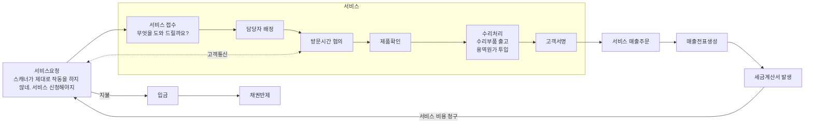

<!-- PDF page: 065 -->

유상서비스

업무흐름: 실선 화살표 / 의사소통: 점선 화살표

범례: 서비스, 회계, 자재, 매출

[그림 22] IT 비즈니스 프로세스 사례

그러면 서비스 사원은 약속된 시간에 고객을 방문하여 제품의 상태를 확인한 후 수리 활동을 수행하고, 작업을 완료한 후 최
종적으로 고객에게 서명을 받아 작업완료에 대한 확인을 받게 된다. 유상 수리인 경우에는 고객에서 수리 대금을 청구하게
되는데 이는 기업에서의 매출이 생성되게 되는 것이다.

한편, 매출 금액과 용역에 대한 수수료를 정산하여 매출을 확정하면 세금계산서가 발행되고 고객에게 세금계산서가 전달되며
고객은 세금계산서를 수령하고 이를 근거로 대금 지불을 진행하게 된다.

고객에게 회수 받아 입금된 돈은 입금처리 프로세스를 통해 기발행된 매출 채권을 반제하여 정산처리하게 된다. 이러한 일련
의 프로세스가 서비스 활동을 통한 고객 서비스 제공과 기업 이익 창출이라는 2가지 활동을 가능하게 한다. 유상으로 서비스
를 진행함에 있어 관련되는 프로세스는 서비스, 회계, 자재, 매출(영업) 업무 도메인이 된다.

이러한 비즈니스 프로세스는 고정되어 있는 것도 있지만 대부분 변화하는 비즈니스 환경에 유연하게 개선되고 적응해야 한
다. 지속적으로 낭비요소와 병목 구간을 확인하고 신속한 업무 처리를 수행할 수 있는 환경을 보장해 줘야 하는 것이다.
