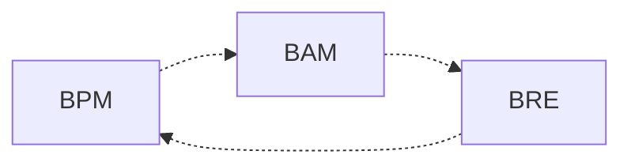

<!-- PDF page: 066 -->

### 04 IT 비즈니스 프로세스 수행방법
#### 가) IT 비즈니스 프로세스 관리
IT 비즈니스 프로세스 관리의 핵심 기법은 BPM이다. BPM은 비즈니스 프로세스를 최적화하고 자동화한다. BAM은 비즈
니스 프로세스에서의 병목현상을 발견하고 관리하기 위한 기법이며, BRE는 비즈니스 프로세스의 흐름을 지정하고 관리
하는 역할을 하는 비즈니스 룰 엔진이다.

[그림 23] IT 비즈니스 프로세스 관리 개념도
##### ① BPM의 이해
BPM(Business Process Management)은 IT 비즈니스 프로세스에 연관된 사람, 정보자원, 업무의 흐름을 통합적으로 관리
하고 최적화, 자동화하는 기법을 말한다. 또한, IT 비즈니스 프로세스를 수행하기 위한 중요한 수단이며, 프로세스 관리가
얼마나 최적화되어 있는지가 경영성과로 직결될 수 있으므로 체계적 관리 기법이 필요하다. BPM은 경영환경변화를 민첩
하게 지원하여야 하며, 비즈니스 프로세스 변경에 능동적으로 대응할 수 있도록 설계되어야 한다.
〈표 21〉 BPM 설계단계

| 설계단계 | 주요수행활동 |
| --- | --- |
| 프로세스정의 | 핵심프로세스 대상을 정의하고 규칙을 발견한다. 프로세스를 분석하고 측정방법을 정의한다. |
| 프로세스실행, 운영 | 프로세스를 정의된 기준에 따라 실행하고 운영 관리한다. 사람과 사람, 시스템과 사람, 시스템과 시스템이 연계되도록 관리한다. |
| 모니터링, 통제 | 업무수행완료 시점, 수준, 수행과정 등에 대하여 모니터링을 수행한다. 프로세스 진행사항을 실시간으로 모니터링하고 기록 및 이력관리를 한다. |
| 프로세스 개선 | 프로세스 수행에 대한 KPI를 확인하고 비교 분석한다. 개선을 위한 시뮬레이션을 수행한다. 실행과 개선을 반복한다. |

##### ② BAM의 이해
BAM(Business Activity Monitoring)은 IT 비즈니스 프로세스를 최적화하기 위하여 프로세스를 실시간 모니터링하고 위험요
소를 사전에 인지하여 프로세스 상의 병목현상을 발견, 통제하기 위한 기법이다.

BAM은 실시간 분석을 위하여 확장된 BI(Business Intelligence) 기법을 함께 사용하기도 하며 BPM을 대상으로 프로세스 흐름을 모니터링하고 관리한다.
