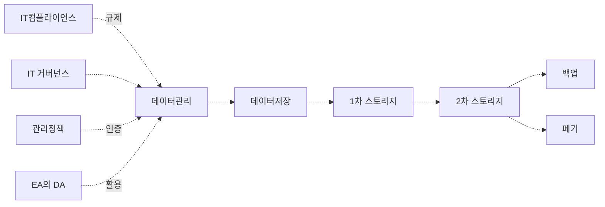

<!-- PDF page: 068 -->

[그림 24] ILM의 개념도

ILM의 구성요소는 기업의 데이터관리 정책과 데이터를 관리하는 기술요소로 구분할 수 있다.
〈표 24〉 ILM의 구성요소

| 구분 | 구성요소 | 역할 |
| --- | --- | --- |
| 관리정책 | IT 거버넌스 | 데이터의 생성, 보관, 폐기 등의 가이드라인 제공 |
| 관리정책 | IT 컴플라이언스 | 법률, 제도, 정책 등의 기준 제공 |
| 관리정책 | 기업데이터 관리정책 | EA⁹의 DA¹⁰ 체계 및 데이터 운영 정책 |
| 기술요소 | 1차 스토리지 | 활용도와 가치가 높고 반복 사용하는 경우 고성능 고가 스토리지 활용 |
| 기술요소 | 2차 스토리지 | 활용도와 가치가 상대적으로 낮아 저성능 저가 스토리지 활용 |
| 기술요소 | 데이터 아카이빙 | 주기적으로 데이터를 보관할 수 있게 하는 기술이며 시스템이 자동으로 처리한다. |
| 기술요소 | 백업 | 테이프 라이브러리 또는 저가형 디스크를 활용하여 백업정책에 따라 별도 보관 |

##### ② IRM의 이해

IRM(Information Resource Management)은 IT 자원들의 효율적인 통합관리가 목적이다. 효율적인 통합관리라고 하는 것은
IT 자원에 대한 중복투자를 막고 투자대비 효율성을 높이는 것으로 인력, IT 장비, 자금, 산출물 등 모든 관련 IT 자원을 관
리하는 것을 말한다.

기업의 정보시스템 규모와 복잡성이 지속적으로 증가하고 있고 체계적인 정보자원 관리가 점차 필요하게 됨에 따라 정보
화 기획, 개발, 성과평가 등 정보화 절차 전반에 공통의 기준과 관리체계를 위하여 IRM이 필요하게 되었다.

IRM은 EA에게 정보자원에 대한 체계를 알려주고, EA는 IRM에게 전사 자원 체계 및 참조체계에 대한 가이드라인을 제시한
다. 즉, IRM과 EA는 상호 보완 관계이다.
9 EA: Enterprise Architecture
10 DA: Data Architecture, EA의 구성요소 중 데이터 아키텍처를 담당
