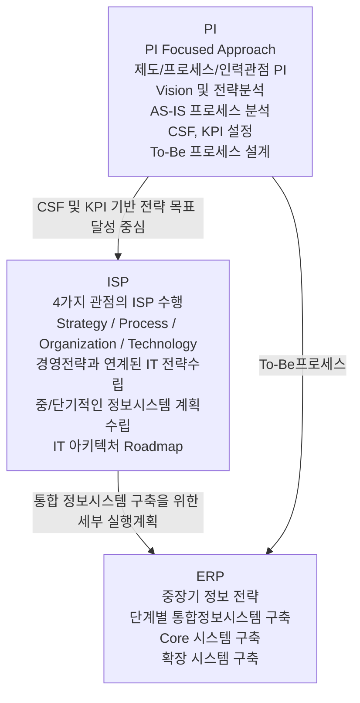
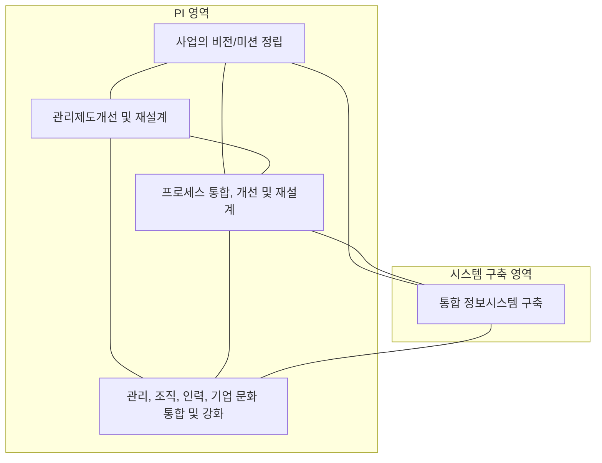

<!-- PDF page: 071 -->

는 것이 대표적인 사례이다. PI는 제도 및 프로세스에 대한 개선을 수행하고 이를 통해 정보화계획을 수립한 후, ERP든
CRM이든 실행 수단으로서의 계획된 항목을 실현하는 시스템을 구축하는 단계로 전개된다.

[그림 25] PI의 수행절차 사례

PI와 ERP의 관계를 보면 PI를 먼저 수행하여 제도/프로세스/인력 관점의 개선과 데이터와 프로세스의 통합을 위한 기반을
마련하고, 이어 통합 시스템을 구축하는 절차로 진행된다.

[그림 26] PI와 ERP의 관계

PI를 통하여 IT 비즈니스 혁신은 2가지 측면에서 접근할 수 있는데, PI를 통해 ERP를 도입하는 방법이 있고, ERP를 통해
급진적인 PI를 실현하는 방법도 있다. 각 기업의 상황에 맞게 전략적으로 도입 계획과 방향을 수립하여야 한다.
