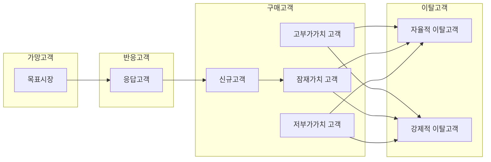

<!-- PDF page: 087 -->

##### ③ SCM과 ERP의 비교
SCM과 ERP는 기업 내부에서 활용하는 중요한 업무지원시스템의 한 부분이다. ERP에 대비한 SCM의 중요한 특징은 물류와
유통관리에 있다. 최근의 ERP에서는 SCM의 일부 프로세스를 포함하는 경우가 있으나 상세한 흐름은 SCM에서 관리된다.
〈표 39〉 SCM과 ERP의 비교

| 구분 | 공급망 관리(SCM) | 전사적 자원관리(ERP) |
| --- | --- | --- |
| 주요 관점 | 계획 수립 및 의사결정 | 업무 프로세스 중심 |
| 데이터 처리 | 프로세스 중심 | 트랜잭션 중심 |
| 주요 기능 | 수요 예측, 주문 관리/계획, 물류관리, 창고관리 등 | 구매, 생산, 자재, 재무, 회계, 영업, 인사 등 |
| 업종 | 제조, 유통이 주요 시장 | 제조, 공공, 금융 등의 전 업종 |
| 업체 규모 | 영세 제조업체의 경우에도 재고를 줄여 도입효과 가능 | 주로 대기업위주로 운영되며 중소기업의 경우 도입 시 효과(ROI)를 고려하여야 함 |
| 도입 효과 | 판매 기회에 맞는 생산 수요 예측이 가능하고 재고관리에 효과적 | 업무 프로세스 단축, 인건비 감소 |

##### ④ SCM의 도입효과

SCM을 가장 성공적으로 도입한 기업인 델 컴퓨터는 공급망 관리를 도입한 후 고객, 델, 부품 공급사 간의 정보를 실시간
으로 연계하고 재고량이 공급망 관리 전 8주분에서 적용 후 12~15일분으로 줄어들게 되었다고 한다.
- 이처럼 공급망 관리의 도입은 수송 배송 역량을 증가시키고 재고를 감소시켜 물류 비용을 줄여주고 철저한 납기 관리로
고객 주문처리 시간을 단축하여 고객만족도를 향상시킬 수 있다.
- 또한 업무의 표준화와 제품 납기, 수주 처리 시간을 단축하여 자금 흐름의 효율성을 향상시킬 수 있다.
#### 바) CRM의 이해
CRM(Customer Relationship Management)은 고객관계관리를 말한다. 고객들의 성향과 요구사항을 미리 파악하여 고객이 원
하는 제품을 만들고 마케팅 전략을 개발하기 위한 경영 전략 체계이다.

오늘날 고객은 제품 및 서비스 정보에 대한 고객 지식이 확대되고 고객의 기대 수준 및 고객 이탈이 증가하기 때문에 기업은
고객 중심적 기업 구조와 다양한 고객 접점 채널 확보, 수익성 높은 고객관리 등 새로운 경영전략을 수립해야 한다.

이를 위해 고객들의 행동패턴, 소비패턴 등의 분석이 필요하고 최근에는 빅데이터 분석과 같이 기업이 내 외부 데이터를 통
합하여 시장과 고객에 대해 분석하여 인사이트를 제공하는 작업이 필요하다.

[그림 33] 기업 고객의 라이프사이클
