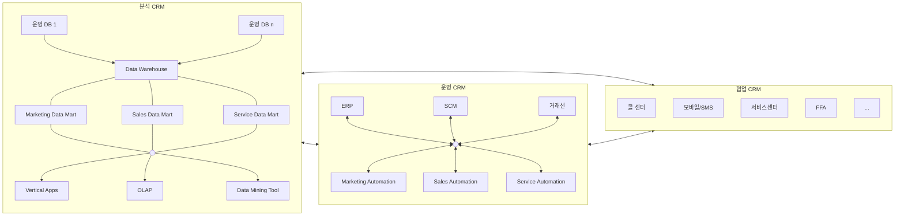

<!-- PDF page: 088 -->

- 기업이 목표로 하고 있는 시장의 고객의 그룹인 가망 고객 중 제품에 관심을 보이는 반응고객을 대상으로 기업은 집중
적으로 마케팅이나 프로모션을 진행하여 신규 고객 창출의 기회를 얻게 된다
- 제품을 구매한 고객 또한, 고객 충성도에 따라 부가가치가 높은 고객을 전략적으로 관리하기 위해 성격이나 유형, 관심
도 등 다양한 관점과 기준으로 분류하고 최적화된 서비스와 마케팅을 수행할 수 있도록 시스템을 갖추는 것이 필요하다.
- 이를 통해 기업은 개별 거래에 의해 발생하는 일시적 수익성보다는 고객 라이프사이클 전체에서 발생하는 총 가치인 고
객 평생가치(Lifetime Value)를 극대화하는 전략을 수립해야 하는데 이것이 CRM의 목표인 것이다.
##### ① CRM의 정의
가트너(Gartner)에서 정의한 CRM은 '수익성 높은 고객과의 관계를 창출하고 지원함으로써 기업 매출을 최적화하고 고객기
반을 확충하는 전략’이다. 즉, 기업 전반의 고객 데이터와 기업 내/외부의 고객 관련 데이터를 통합하여 분석하고 이를 다
양한 고객 접점에 제공하여 기업과 고객이 상호작용하는데 활용하는 경영기법이다. 이는, 고객에 대한 정확한 이해를 바탕
으로 고객이 원하는 제품과 서비스를 지속적으로 제공하여 고객 평생가치를 극대화하여 수익성을 높일 수 있는 통합된 프
로세스인 것이다.
##### ② CRM의 분류
CRM은 프로세스 관점에 따라 기업이 고객과 발생한 다양한 데이터를 수집하고 의미 있는 정보로 분석하여 제공하는 분
석 CRM과 이를 바탕으로 마케팅, 서비스, 영업 활동이 주축이 되는 운영 CRM, 다양한 채널을 통해 고객과 상호작용을 하
는 협업CRM으로 분류된다.

[그림 34] CRM의 분류

CRM을 분류에 따라 구분을 나누어 둔 것은 어디까지나 이해를 돕기 위한 것이고, CRM이 최종적으로 바라보는 영역은 고
객이다. 고객을 정확하게 이해하기 위해서 데이터 분석이 필요하고 업무지원시스템의 도움도 필요하다. 또한, 고객과의 다
양한 접점(Channel)도 필요하게 된다.

다음의 표는 이러한 CRM의 속성들을 분류별로 비교하여 설명한 것이다.
