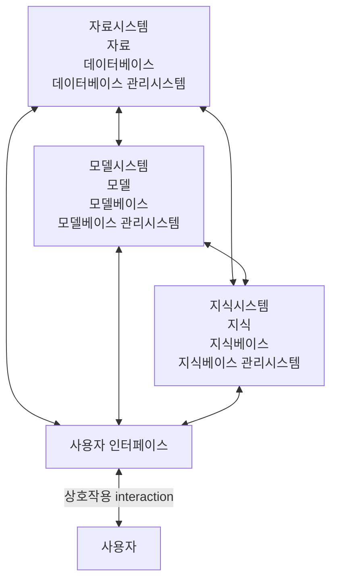

<!-- PDF page: 095 -->

[그림 38] DSS의 구성도

사용자는 사용자 인터페이스를 통해 주로 지식시스템으로 의사결정에 필요한 정보를 얻는다. 또한, 모델시스템 관리와 데
이터베이스 관리를 위하여 각각 해당 시스템에 접근하여 업무를 수행하게 된다.
〈표 46〉 DSS의 구성요소

| 구성요소 | 설명 |
| --- | --- |
| 데이터베이스 관리시스템 | 의사결정을 위한 기본 데이터로 기업의 재무데이터, 회계데이터, 매출/마케팅 데이터, 생산, 인적자원 데이터 등 모든 기업 활동에 의해 생성된 데이터 |
| 모델베이스 관리시스템 | 유사한 유형의 문제를 일관성 있게 해결할 수 있도록 개발된 분석 도구로 계량된 모델들이 복잡한 계산을 수행하여 문제 해결의 효율성과 정확성을 높여주는 역할 수행 통계모델, 예측모델, 선형계획모델, 시뮬레이션모델 등이 있음 |
| 지식베이스 관리시스템 | 정성적인 정보를 제공하는 역할로 계량화하기 어려운 비구조적인 의사결정 문제를 지원 |
| 사용자 인터페이스 관리시스템 | 사용자 인터페이스는 의사결정자와 의사결정자지원시스템 사이에 이루어지는 모든 의사소통의 형태를 포함하는 창구로 유연성, 성능, 편리함을 보장 |

##### ④ DSS 데이터 모델

DSS에서의 데이터 모델은 데이터와 함께 의사결정권자가 데이터를 분석하는 틀을 제공하여, 합리적인 의사결정을 할 수
있도록 지원한다. 데이터 모델 유형은 다양한 알고리즘에 의하여 생성되며 지속적으로 개선 개발되고 있다. 최근에는 인공
지능(AI)을 활용한 예측부분에 초점을 맞추어 진화하고 있으며 모델 유형도 다변화되고 있는 추세이다.
