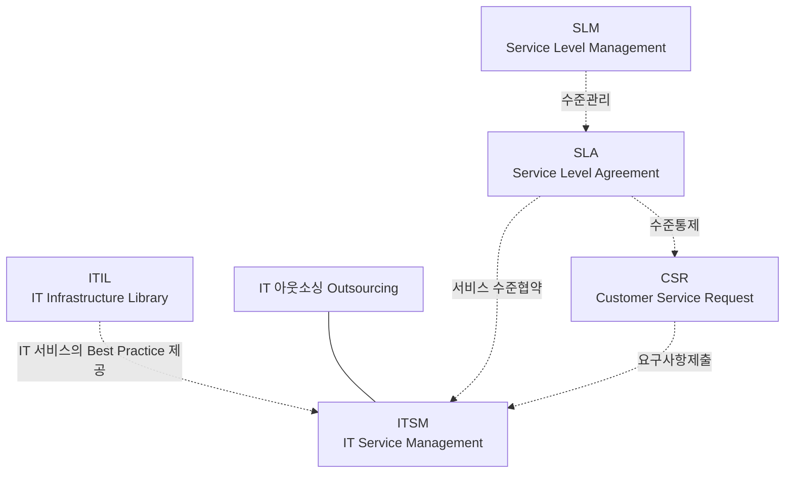

<!-- PDF page: 098 -->

일반적으로 대시보드의 화면 구성은 사용자에 맞게 커스터마이징이 쉽고 실시간 데이터를 분석하거나 스프레드시트와 같은
툴과도 쉽게 연동되도록 지원한다.
### 04 IT 서비스관리의 이해
#### 가) IT 서비스관리의 개요
일반적으로 IT 서비스관리는 ITSM(IT Service Management)으로 통칭된다. 실무적으로 ITSM은 IT 서비스에 대한 체계적
관리와 서비스 품질을 보증하는 수단으로써 시스템화되어 활용되고 있다

[그림 41] IT 서비스관리 기술의 상관관계도

- ITSM은 IT 서비스의 표준 모델(Best Practice)인 ITIL(IT Infrastructure Library)를 활용하고 있고, 기업 간 거래형태에 따라 IT
아웃소싱으로 진행될 수 있다.
- IT 서비스가 실현되기 위해서는 서비스 수준에 대한 협약(SLA)이 필요하다.
- 협약된 SLA는 IT 서비스 품질의 측정기준이며 SLM을 활용하여 체계적 관리를 수행한다.
- IT 서비스에 대한 업무요청은 CSR(Customer Service Request) 프로세스를 활용한다.

ITSM은 IT 서비스의 표준 모델(Best Practice)인 ITIL(IT Infrastructure Library)을 활용하고 있고, 기업 간 거래형태에 따라 IT
아웃소싱으로 진행되기도 한다.

또한, 하나의 IT 서비스가 실현되기 위해서는 서비스 수준에 대한 협약(SLA)을 해야 하고 협약된 SLA는 IT 서비스 품질의
측정기준이며 베이스라인이 된다. 따라서 이 기준의 수립과 관리가 중요하다 하겠다.

상호 간 IT 서비스에 대한 서비스 수준이 결정되면 그 수준에 맞추어 IT 서비스를 제공하게 되고, 이용자의 IT 서비스에 대
한 요청 업무는 CSR(Customer Service Request) 프로세스를 활용한다.

IT 서비스관리와 연관된 대표적인 표준으로는 eSCM과 ISO/IEC20000이 있다. 이 표준은 모두 ITIL에 그 뿌리를 두고 있다.
- eSCM(eSourcing Capability Model)은 서비스 제공자가 고객에게 IT 서비스를 제공하기 위해 품질과 역량을 객관적으로
평가하는 국제적인 품질평가모델이며 비즈니스 전단계에서 IT 서비스 이행 지침을 제시하고 있다.
