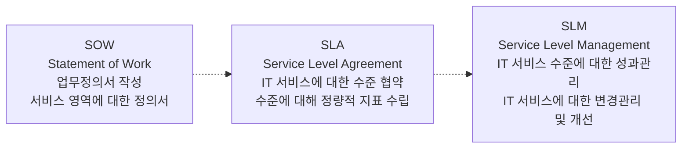

<!-- PDF page: 102 -->

| 비교항목 | Version 2 | Version 3 |
| --- | --- | --- |
| Restrictions & ITIL Version 3 Improvement | IT 서비스 전 영역의 지원 부족 비즈니스 연계 부족(성과, 지표, 프로세스) IT Governance 제시 부족(연계, 모델) 현재 프로세스와 Gap(SOA, BSM 등) | IT Service Lifecycle 제시 Business Value Driven IT service 제시 IT Strategy와 IT 서비스 설계, 이행, 개선 모델 현재 사용중인 SOA, BRM, IT 운영 프로세스 연계 |

#### 다) SLA의 이해

IT 서비스를 제공하는 기업과 고객 간의 서비스 품질문제는 서비스를 제공하는 기간 동안 민감하게 관심을 가지는 영역
이다. 그러므로 IT 서비스를 제공하는 측과 이용하는 측 사이의 서비스 수준에 대한 명확한 가이드라인이 필요하다.

IT 서비스 공급기업과 고객 간의 서비스 적정수준에 대하여 서비스의 범위, 항목, 형태, 성능, 측정방법, 가격 등에 대한
협약을 SLA(Service Level Agreement)라고 하고, 이를 지속적으로 모니터링하고 변경 • 관리하는 체계를 SLM(Service
Level Management)라고 한다.

[그림 43] SLA와 SLM의 상호 흐름도

SOW(Statement Of Work)는 SLA의 세부적인 서비스 및 작업 내용을 규정한 작업명세서로서 프로젝트관리에서는 요구사항을
기술한 작업명세서로도 사용된다.
##### ① SLA 도입 시 효과
- 원활한 의사소통: 서비스 수요자와 공급자 간의 의사소통 도구로 활용
- 갈등 방지: 서비스 수준에 대한 기대차이를 좁히고, 해결 근거를 마련
- 객관적 평가: 서비스 품질에 대한 객관적이고 정량적 평가 가능
- 지속적 통제: 서비스 관리에 대한 통제체계를 제공
##### ② SLA의 구성요소 및 항목별 지표
SLA는 서비스 수준관리 지표에 대한 서비스 목표수준을 수립하고 목표에 대한 성과측정기준을 마련하고 서비스 수준에
대한 보고체계를 가지고 있다.
〈표 52〉 SLA의 구성요소

| 구성요소 | 설명 |
| --- | --- |
| 서비스 수준관리 지표 (Service Level Metrics) | 서비스 제공 영역별 서비스 수준을 정량적으로 파악하기 위한 성과지표 |
| 서비스 목표 수준 (Service Level Objectives) | 서비스 수준 관리 지표별 목표치 및 최소치를 제시하고 미달 시에는 패널티 부과, 초과 달성 시에는 인센티브 부과 등의 기준 마련 |
| 서비스 성과측정 기준 (Service Level Measurements) | 정의된 서비스 수준관리지표를 정량적으로 측정하기 위한 방법(측정구간, 측정주체, 측정주기 등을 포함한다) |
