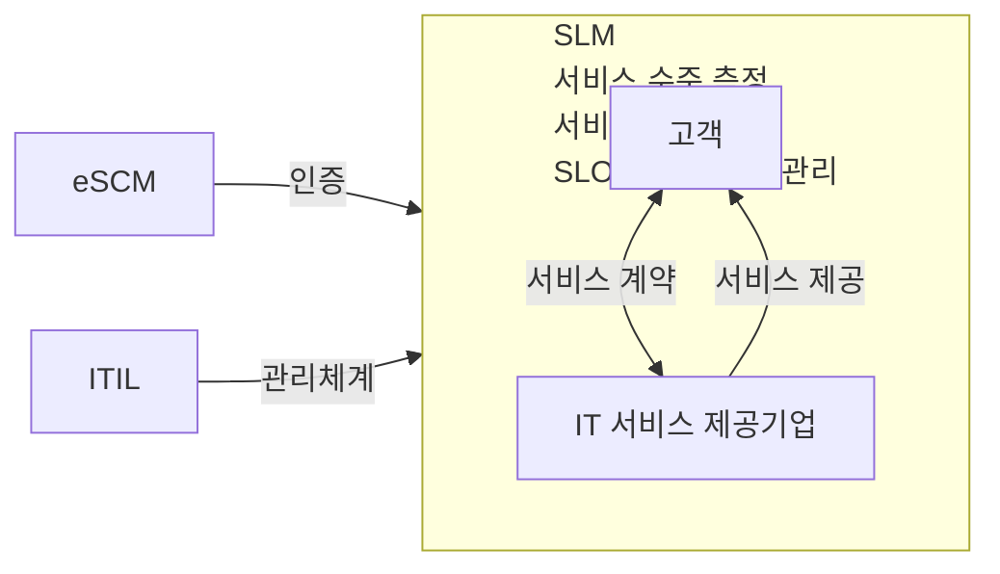

<!-- PDF page: 103 -->

| 구성요소 | 설명 |
| --- | --- |
| 서비스 수준 보고 (Service Level Reports) | 서비스 수준에 대한 의사소통체계로서의 보고 형식 및 보고 방법 |

그리고, SLA에서 표현되는 항목별 지표를 예를 들어 설명하면 다음과 같다. 특히, 지표로 제시된 항목들은 서비스 수준 항목
또는 형상항목(CI, Configuration Item)16으로도 불린다.
〈표 53〉 SLA의 항목별 지표 예시

| 항목 | 지표예시 |
| --- | --- |
| 응용시스템 | CSR적기처리율, 프로그램 변경 및 증감률, 시스템 응답속도 및 시간, 장애건 수 등 |
| 하드웨어 | 시스템가동률, 백업 준수율, 장애처리율, 시스템 장애건 수, 장애처리절차 준수율, 거래 특성 별 거래건 수, 월별 디스크 사용현황관리 등 |
| 네트워크 | 회선 장애율, 네트워크 장비 및 회선 가용성, 네트워크 가동률, 네트워크 문제해결 준수율 등 |
| 서비스 데스크 | 콜처리율, 유형별/업무별 처리건 수, 콜대기율, 헬프데스크 시스템 가용률, 데스크 인력 근태 등 |
| 보안 | 사용자 IT 요청 즉시 처리율, 고객 프로파일 정확도, 보안교육 실시회수, 개인정보보호를 위한 점검회수 등 |
| 전략기획 | 제안권고 안의 제출회수, 정보화 교육의 계획 준수율 등 |

#### 라) SLM(Service Level Management)
SLM은 ITIL의 핵심프로세스 중 하나이다. SLM을 활용함으로써 고객과 합의된 품질 수준의 서비스가 제공되는 것을 보장
함으로써 고객 신뢰 증진 및 서비스 수준향상을 위한 프로세스를 관리할 수 있다.

〈그림 44〉 SLM의 개념 및 범위

SLM은 SLA의 내용(SLO, Service Level Objectives)을 관리하고, SLA의 위배여부를 알려주는 기능을 제공한다. 따라서 IT
서비스 수준을 관리하기 위해서는 SLM 도입이 필수적이라고 할 수 있다.
16 형상항목(CI, Configuration Item): CI(Configuration Item)의 경우 CMDB(Configuration Management DataBase)에서 저장, 변경, 관리된다.
