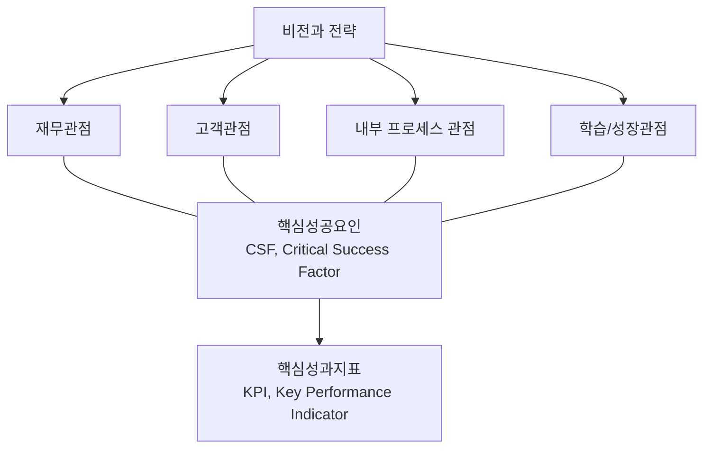

<!-- PDF page: 109 -->

〈표 57〉 BSC의 구성요소

| 구성요소 | 설명 |
| --- | --- |
| 관점 | Perspective 재무, 고객, 프로세스, 학습과 성장 관점 |
| CSF | Critical Success Factor 비전과 전략의 성공적인 달성을 위해 꼭 성공시켜야 하는 요소 |
| 전략맵 | Strategy Map BSC상의 CSF들 간의 인과관계를 나타내주는 그림으로 조직이 가치를 창출하는 방법을 표현 |
| KPI | Key Performance Indicator CSF의 수준과 성공여부를 측정 및 관리하는 방법을 표현한 지표 |

#### 다) BSC의 4가지 관점

BSC는 재무 관점(Financial), 고객 관점(Customer), 프로세스 관점(Process), 학습과 성장 관점(Growth and Innovation)의 4
가지 관점으로 이루어져 있으며 재무적 시각과 비재무적 시각을 동시에 관리한다.

[그림 45] BSC의 4가지 관점

4가지 관점은 상호 유기적으로 연결되어 관리된다. 예를 들어 신제품 개발은 학습과 성장 관점에서 관리하고 제품품질과
생산효율 개선은 내부 프로세스 관점에서, 고객만족과 납기준수와 같은 지표는 고객관점에서 관리된다. 또한 주주 배당
이익 영역은 재무적 관점에서 관리된다.
〈표 58〉 BSC의 4가지 관점 상세 설명

| 관점 | 주요항목 | 주요지표 |
| --- | --- | --- |
| 재무적 관점 | 매출액, 순이익, 원가절감 재무적인 평가 | 현금흐름, 재고 및 채권 영업 이익률 |
| 고객 관점 | 고객의 충성도 제고 고객만족도 향상 | 고객만족도, 적시 공급률 |
| 내부프로세스 관점 | 프로세스 최적화 프로세스 병목현상 제거 | 프로세스 Cycle Time 제품 단위별 원가 |
| 학습과 성장 관점 | 구성원의 학습 노력도 역량증진에 대한 성과측정 | 직원 만족도 신제품 개발건 수 |
