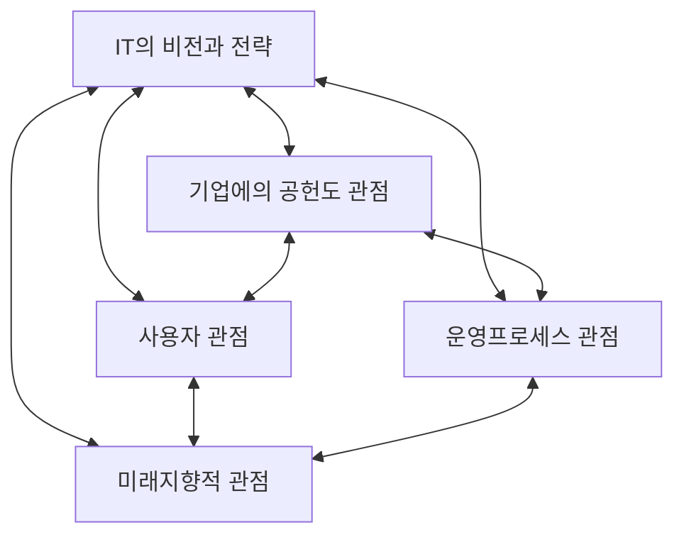

<!-- PDF page: 110 -->

### 04 IT 분야 균형 성과평가 기법
#### 가) IT-BSC의 개요
IT-BSC(IT-Balanced Score Card )는 IT 분야의 투자성과평가에 BSC의 개념을 도입하여 IT가 기업의 전략적 목표달성에
기여하도록 하는 성과관리 도구이다.

기업활동에 있어 IT가 차지하는 비중이 증대됨에 따라 IT 투자에 대한 체계적 평가방법이 필요하고 전통적인 투자평가방
법인 재무기반 평가로는 무형적 IT 투자에 대한 계량화가 어려워 IT-BSC를 도입하게 되었다.
#### 나) IT-BSC의 구성요소

[그림 46] IT-BSC의 4가지 관점

IT-BSC는 4가지 관점의 구성요소를 가지고 있으며 기업의 BSC와 연계되어 있다. 즉, 지표 간 인과 관계가 형성되어 있
으며 결과가 상호 공유되는 구조이다. IT-BSC와 BSC는 재무적 지표와도 최종 연결됨에 따라 경영자의 의사결정에 도움
을 줄 뿐만 아니라 IT 분야의 성과평가에서 균형잡힌 시각을 제공한다.
〈표 59〉 IT—BSC의 관점별 BSC 연계 구조

| 관점 | 측정대상 | BSC 연계 |
| --- | --- | --- |
| 기업에의 공헌도 | IT 투자로부터 기업의 가치를 창출 | 재무적 관점 |
| 사용자 관점 | IT 서비스 공급자 및 사용자의 가치를 극대화 | 고객 관점 |
| 운영프로세스 관점 | IT 제품 및 서비스를 효율적으로 제공 | 내부프로세스 관점 |
| 미래지향적 관점 | 지속적 발전을 위한 IT 서비스 제공 및 기술개발 지원 | 학습과 성장 관점 |
