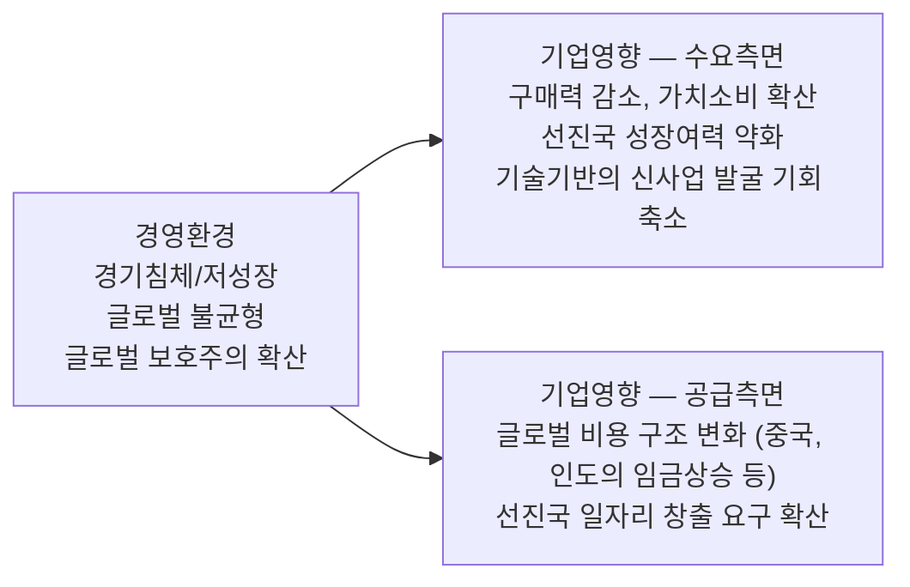

<!-- PDF page: 116 -->

### 01 IT 비즈니스 환경변화의 흐름

#### 가) IT 비즈니스 환경변화의 이해

##### ① 급변하는 IT 비즈니스 환경

[그림 47] 경영환경의 변화

오랜 글로벌 경제 침체와 저성장으로 글로벌로 진출한 많은 기업들이 어려움을 겪고 있다. 특히 내수성장이 둔화되고 해외 직접투자가 증가하면서 기업이 부담해야 하는 비용은 늘어나는 반면 시장 개방과 환율 불안 등으로 기업 비즈니스 환경은 점점 더 복잡해지고 있다. 이러한 상황을 극복하기 위해 대기업의 경우 글로벌 소싱을 확대하고 제조기업의 경우 서비스업으로 진출하는 등의 다양한 전략을 펼치고 있다.

##### ② IT 비즈니스 환경변화의 특징

비즈니스 환경변화에 대응하기 위해 기업들은 전문화/모듈화/대형화/국제화/네트워크화를 통해 새로운 비즈니스 모델을 통해 시장 경쟁우위 확보를 위해 사업을 다각화하고 있다. 또한 IT 기술의 급속한 발달과 스마트 시대의 도래에 따라 비즈니스 패러다임 변화를 촉진시키고 있다.

IT의 끊임 없는 진화, 소비패턴의 변화, 플랫폼의 다양화, 기업의 혁신 요구가 증대되는 등 기업 경영활동의 대내외 환경변화가 가속화되고 있다.

오프라인 기업의 온라인시장 진출, 모바일 비즈니스 활성화, 융합 비즈니스의 등장 등 사업 경계와 영역 제한이 사라져 비즈니스 채널이 다각화되어 온라인시장을 통해 기업은 다양한 고객을 만날 수 있는 기회를 확보하였고 시너지 효과로 창출하였다. 또한, SNS 기반의 스마트 쇼핑, 1인 인터넷 기업 및 크라우드 소싱의 활성화 등 소비 트렌드를 반영한 신개념의 비즈니스들이 등장하였다. 고객지향적 마케팅이 활발해지고 무료서비스 제공이 활성화되고 사회 공헌 비즈니스 등 지속 가능한 경영활동을 위한 가치 지향적 비즈니스 또한 확산되고 있다.
