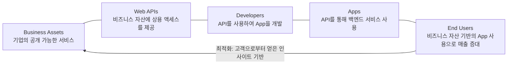

<!-- PDF page: 123 -->

##### ② API 경제

기업의 내부 비즈니스 자산 또는 서비스를 웹API(Application Programming Interface)의 형태로 3rd Party에 공개하여 새로운 자산의 생성 및 소비를 통해 추가적인 비즈니스 가치를 창출하는 활동을 API 경제(API Economy)라고 한다.

API 공개 데이터가 새로운 비즈니스가 되는 시대에 효과적으로 시장 대응을 하려면 조립 가능한 비즈니스 모델을 모든 채널에 적용하고 운영과 비즈니스의 민첩성을 향상시켜야 한다. 즉, API를 통해 플랫폼에 상관없이 다양한 어플리케이션들이 연결될 수 있는 환경이 제공되게 된다. 스마트폰 등을 통해 제품을 검색하거나 구매하는 소비자의 성향과 구매 패턴이 빅데이터로 쌓이면 이를 API를 통해 공개하고 각 사가 축적한 마케팅 데이터를 공동 이용하는 형태로 발전된다.

또한 앱 개발자들은 API 공개 데이터를 비즈니스 자산으로 활용하여 새로운 앱 등을 구축해서 소비자에게 다양한 맞춤형 서비스를 제공할 수 있게 된다. E*Trade는 2010년부터 자사의 주식거래 서비스를 API화하여 파트너사에 공개하였고, 파트너 기업은 이용자를 대신하여 판매 주문이나 포트폴리오 접근이 가능하게 되었다.

그리고 E*Trade는 고객이 자사 사이트에 접속하지 않더라도 타 채널을 통해 자사 서비스를 이용할 수 있도록 제공하여 서비스 품질을 높이고 안정된 서비스를 제공하고 있다.

미국의 아마존, 트위터, 구글 등의 IT 기업들도 자사의 데이터 및 서비스를 API로 공개하여 수익을 창출하고 있다. 빅데이터, 클라우드 서비스, 소셜API, BaaS(Backend as a Service) 등을 기반으로 기업의 핵심 자산인 API를 비즈니스 생태계를 통해 공유함으로 내/외부의 효율 극대화와 새로운 수익창출을 기대할 수 있다. 하지만 API를 만들어 관리한다는 것은 쉽지 않은데 API를 제공하더라도 계정, 인증, 보안 등의 필수적인 기본관리를 수행해야 하고 기업들이 제공하는 API가 점점 많아지고 다양해지고 있기 때문에 이에 대한 체계적인 관리도 요구된다.

[그림 54] API 가치사슬

API를 비즈니스 모델로 활용하려면 API의 가치사슬을 이해해야 한다. 즉, 기업의 데이터 및 서비스는 API를 통해 공개되고 3rd Party 개발자들은 이 오픈 API를 활용하여 혁신적인 어플리케이션을 만든다. 이에 API를 제공하는 기업은 API를 직접 사용하는 3rd Party 개발자들의 요구사항과 어플리케이션 사용자의 니즈까지 이해해야 한다.

더 나아가 기업 내부적으로는 공개된 API를 모니터링하고 관리할 수 있는 체계를 갖추어야 하고, 외부 개발자들이 API를 쉽게 이해하고 사용할 수 있도록 정형화된 문서나 개발자가 소통할 수 있는 사이트를 제공할 수 있어야 한다.

스마트폰과 태블릿, 스마트 워치에 이르기까지 다양한 모바일 기기들이 우리 일상에 깊숙이 자리잡고 있는 시점에 기업들은 전략적인 API 관리를 통해 다양한 고객 접점을 관리할 수 있어야 한다.
