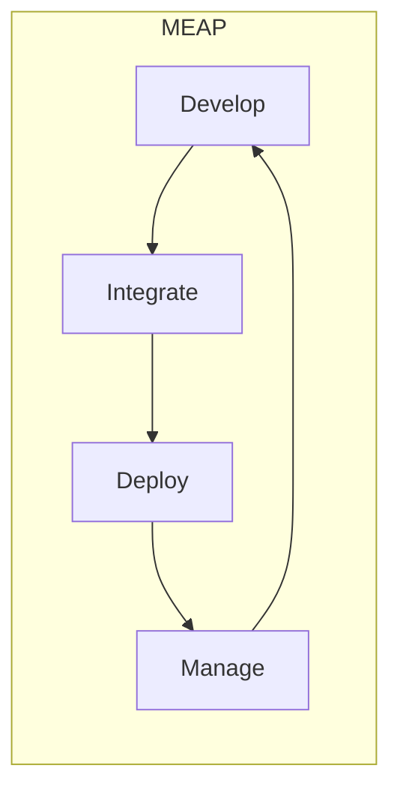

<!-- PDF page: 133 -->

| 기술 | 설명 | 세부 기술 |
| --- | --- | --- |
| 모바일 응용서버 | • 유선 통신 환경뿐 아니라 무선 통신 환경에서도 이용할 수 있는 여러 응용 서비스를 쉽게 개발하고 운영할 수 있는 소프트웨어 플랫폼 | |

##### ③ MEAP(Mobile Enterprise Application Platform)

모바일 엔터프라이즈 어플리케이션 플랫폼(MEAP)은 단말 환경의 다양성에 대응하고 다수의 어플리케이션들이 공유하여 재활용하기 위한 플랫폼을 뜻한다.

- MEAP 필요성은 재활용성과 비용절감이 핵심 요소라고 할 수 있다. 다양한 스마트폰 OS/스마트폰 하드웨어/통신사 환경에 대한 코드 재활용성 제공

플랫폼 공유를 통해 서비스를 위한 인프라, 미들웨어에 대한 중복투자 방지

다양한 단말기에 대한 모바일 화면 개발 지원

테스트와 연동을 위한 지원

[그림 57] MEAP 개념도

###### MEAP의 구성

MEAP은 모바일 개발/실행/운영의 라이프사이클을 커버하기 위하여 통합개발환경(IDE), 미들웨어 역할의 실행환경 프레임워크, 기존시스템 통합을 위한 표준 인터페이스, 보안 및 기기관리를 위한 단말관리(MDM)로 구성된다.

〈표 74〉 MEAP 구성요소

<table>
<tr><th>구분</th><th>구성요소</th><th>내용</th></tr>
<tr><th rowspan="2">개발환경</th><td>통합개발환경</td><td>• 프로젝트 구성, 코딩, 테스팅을 위한 시뮬레이터</td></tr>
<tr><td>Mobile Framework</td><td>• One Source Multi Use를 위한 메타(추상화) 계층 제공</td></tr>
<tr><th rowspan="3">실행환경</th><td>배포관리</td><td>• 모바일 앱의 배포 및 버전 관리</td></tr>
<tr><td>실행 프레임워크</td><td>• 플랫폼 및 단말에 독립적인 코드에 대한 실행 기능(일종의 미들웨어 역할), Device API연동 wrapper 제공</td></tr>
<tr><td>백 엔드 통합 인터페이스</td><td>• 기존 어플리케이션과 표준 인터페이싱 및 재사용</td></tr>
<tr><th rowspan="2">운영환경</th><td>MDM(Mobile Device Management)</td><td>• 단말기 관리, 단말 어플리케이션 관리, 보안 관리, 접근 제어 및 단말 분실관리</td></tr>
<tr><td>서비스 운영 및 관리</td><td>• 통합 인터페이스 모니터링 및 관리</td></tr>
</table>
