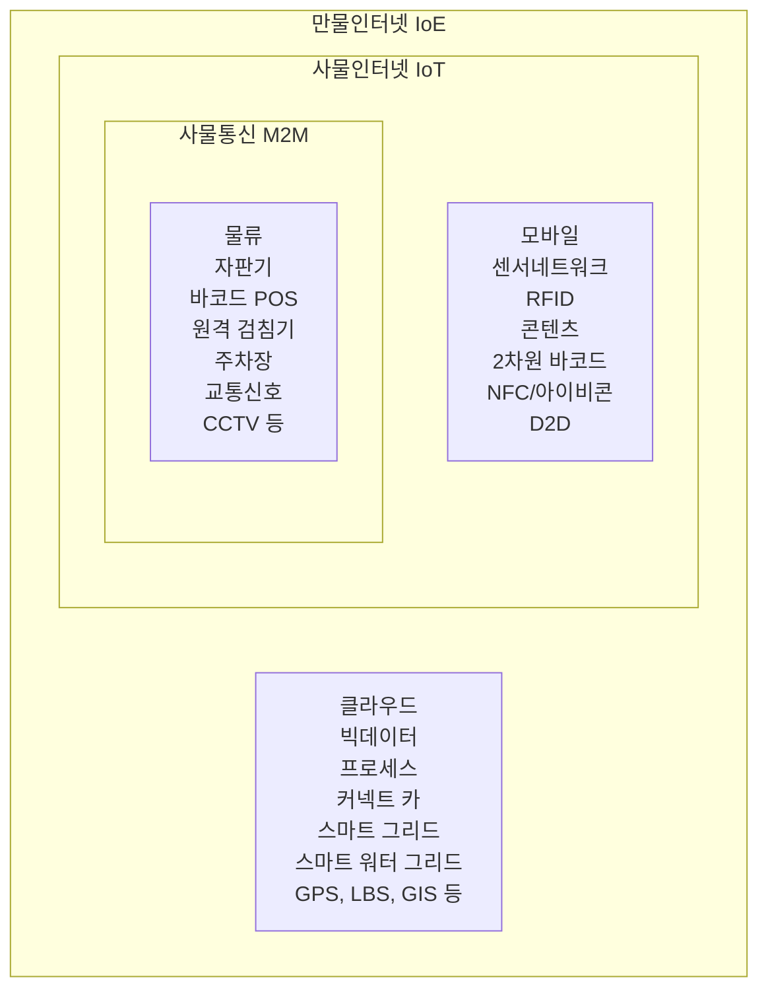

<!-- PDF page: 137 -->

[그림 61] 사물통신, 사물인터넷, 만물인터넷 서비스 사례

세계 사물인터넷은 도입기 또는 성장 초기에 위치해 있지만 2022년까지 연 평균 20% 이상 성장하여 1조 2000억 달러에 이를 것으로 전망되고 물리적인 세상과 디지털이 만들어낸 세상 사이의 거래 비용을 감소시켜 새로운 가치를 창출해줄 것이며 결국 사물인터넷을 통해 기존 산업의 생산성이 향상되고 새로운 시장이 창출될 것으로 기대하고 있다. 이러한 사물인터넷은 연결을 중시하는 시장의 욕구와 기술 혁신은 언제, 어디서나 정보 접근이 가능하도록 모바일 중심의 네트워크 구축으로 변화를 촉진시킨다. 연결속도의 증가, 다양한 모바일 기기 및 연결 기술 등의 확산은 기존보다 훨씬 많은 데이터를 생산 • 공유하는 계기를 마련하여 빅데이터 처리 분석 산업까지 확대되고 있다. 또한 시장의 상품 지식에 대한 축적, 활용 증대, 연결 과정 등을 통해 기존 공급자보다 수요자 중심으로 시장 변화를 촉진시키고 있으며, 이는 미래 기술, 제품 등의 개발 방향에 큰 영향을 미치게 될 것으로 보인다.

사물인터넷 산업 성장을 위해 기대되는 기능들은 최적화 기능, 업종을 초월한 다른 사회 인프라와의 복합화, 사회 인프라의 운용관리 기능 등 개인의 편리성보다는 사회 인프라의 효율 향상이나 에코 대응 등 사회적인 이익 증대에 기여할 수 있을 것이다.

##### ③ 클라우드 컴퓨팅(Clouding Computing)

네트워크, 서버, 스토리지, 서비스 어플리케이션 등 IT 자원을 소유하지 않고 필요시 인터넷을 통해 서비스 형태로 이용하는 컴퓨팅 방식을 클라우드 컴퓨팅(Cloud Computing)이라고 한다. 이는 언제 어디서나 보다 저렴하고 향상된 양질의 IT 서비스를 제공할 수 있음을 의미한다. 클라우드 컴퓨팅의 개념은 각 단체별로 다양하게 정의되나 가트너에서는 클라우드 컴퓨터를 인터넷 기술을 활용하여 다수의 고객들에게 높은 수준의 확장성을 가진 자원들을 서비스로 제공하는 컴퓨팅의 한 형태라 정의하였고 포레스터 리서치에서는 표준화된 IT 기반 기능들이 IP를 통해 제공되며, 언제나 접근이 허용되고 수요의 변화에 따라 가변적이며, 사용량이나 광고에 기반한 과금 모형을 제공하며 웹 또는 프로그램적인 인터페이스를 제공하는 컴퓨팅이라 하였다.

클라우드 컴퓨팅은 신기술이 아니라 이전부터 IT 업계에 보편화되어 있던 개념이었는데 전 세계적인 경기 불황의 여파로 기업들이 비용절감으로 위해 클라우드 컴퓨팅에 관심을 보이기 시작하면서 시장의 이슈로 떠오르게 되었다. 클라우드 컴퓨팅은 큰 의미로 렌탈 비즈니스의 한 형태라고 볼 수 있다. 초기의 ASP와 서버 호스팅 사업에서 가상화 기술이 발전하면서 서로 다른 공간에 위치한 IT 리소스를 하나의 시스템으로 통합하여 서비스할 수 있게 되었다.
