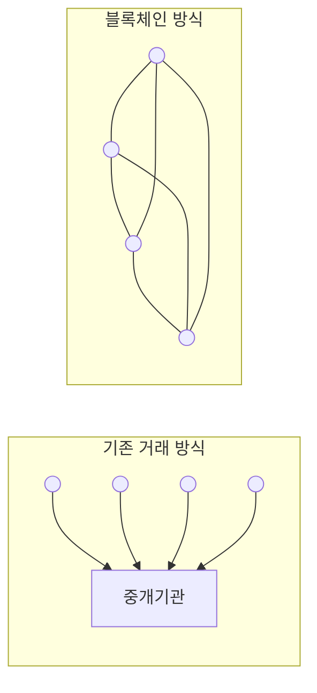

<!-- PDF page: 141 -->

〈표 78〉 가상화의 기능

| 기능 | 설명 | 사례 |
| --- | --- | --- |
| 공유 (Sharing) | • 다수의 많은 가상 자원들이 하나의 동일한 물리적 자원에서 사용되는 기능 • 물리적 자원의 일부분을 가상화된 자원마다 할당하거나 혹은 물리적 자원에 대하여 타임 쉐어링 기법으로 공유하는 방식으로 사용됨 | • 논리적 파티셔닝(LPARs) • 가상머신(VM) • 가상디스크 • 가상LAN(VLANs) |
| 단일화 (Aggregation) | • 공유의 반대되는 가상화 개념으로 가상자원은 여러 개의 물리적 자원들에 걸쳐 존재함, 외견상 전체 용량을 증가시키고 전체적인 관점에서 활용과 관리를 단순화시켜 줄 수 있음 | • 스토리지 가상화 |
| 에뮬레이션 (Emulation) | • 물리적 자원에는 존재하지 않았으나, 가상 자원에는 어떤 기능들이나 특성들이 처음부터 존재했던 것처럼 보이는 기능 | • iSCSI • 가상 테이프 스토리지 |
| 절연 (Insulation) | • 가상화된 자원들과 물리적 자원들 간의 상호 맵핑은 가상화 자원들 또는 가상화 자원들을 사용하는 사용자들에게 아무런 영향을 미치지 않으면서 물리적 자원들이 교체될 수 있도록 해주는 기능으로 투명한 변경(Transparent Change)으로 불리기도 하며, 장애방지(Failure Proof)의 효과 | • 다중디스크를 사용하는 RAID 스토리지 컨트롤러 |

##### ⑥ 블록체인 서비스

최근 몇 년에 걸친 암호화폐 Bitcoin의 급등으로 Bitcoin의 핵심기술인 블록체인에 대한 관심이 급등하였다. 블록체인은 분산 네트워크 기반의 탈 중앙화 개념으로 P2P 방식으로 데이터를 블록으로 정의하여 분산네트워크 상에서 저장하여 체인을 구성하는 분산 원장 네트워크 기술이다.

###### 블록 체인의 특징

기존 거래방식과 달리 거래 원장 데이터들이 블록 단위로 네트워크상의 모든 노드들에 기록되어 관리되고 검증됨

[그림 63] 블록체인 거래방식

###### 탈 중앙화

네트워크상의 모든 노드들이 협력하여 중앙 서버(중앙집중적 3자) 없이 무결성을 시스템 자체가 증명하고 보증한다.
