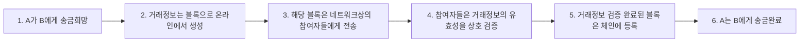

<!-- PDF page: 142 -->

###### 보안성 향상

네트워크상의 모든 노드들 중 과반수 이상 노드의 동의를 얻어야 거래가 인정돼 보안성 향상

###### 거래내역 투명성

참여하는 네트워크상 모든 노드들이 장부를 공유하여 거래 기록이 모두 투명하게 공개된다.

###### 안정성 향상

네트워크 분산 구조이므로 참여한 일부 노드상에 비정상적인 에러 혹은 오류가 발생하여도 복구가 손쉽게 가능하다.

###### 경제성 향상

중앙 서버가 존재하지 않아 집중 관리 비용과 금융거래 비용 절감이 가능하다.

###### 개인정보보호

중앙 시스템의 해킹이나 시스템 오류로 인한 개발 정보의 수집 • 보안 • 유출 부담이 감소된다.

[그림 64] 블록체인 거래 개념도

블록체인 네트워크의 모든 노드들이 블록 생성 및 검증을 함께 담당하고, 반수 이상의 노드가 인정을 해야 거래가 인정되므로 임의로 수정하거나 조작이 불가능하다.

#### 나) 스마트 인프라

##### ① 스마트 시티

스마트 시티에 대한 많은 뉴스와 관심이 집중되고 있다. 스마트 시티란 “도시에 ICT • 빅데이터 등 신기술을 접목하여 각종 도시문제를 해결하고, 삶의 질을 개선할 수 있는 도시모델”이라고 정의할 수 있다.²³ 스마트 시티는 노후화되고 있는 도시와 부족한 에너지, 환경 오염과 범죄 등 전 세계 도시에서 겪고 있는 문제들을 해결할 수 있는 대안으로 각광받고 있으며, 이러한 스마트 시티의 건설을 위하여 인공지능, 빅데이터, 5G 이동통신 등의 최신 기술을 활용하여 “스마트 교통”, “스마트 환경”, “공공안전”, “생활복지”, “스마트 에너지” 서비스 등을 도시민에게 제공하려는 스마트 인프라의 대표적인 개념이다.

23 국토교통부 참조
