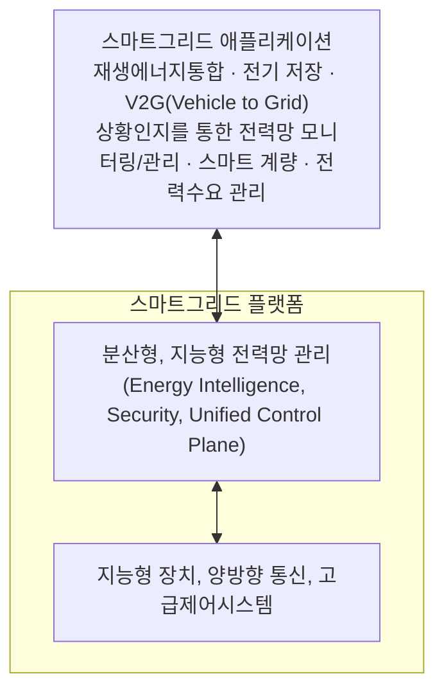

<!-- PDF page: 144 -->

| 구분 | 현재 전력망 | 스마트 그리드 |
| --- | --- | --- |
| 제어시스템 | 국지적 제어 | 광범위한 제어 |
| 가격정보 | 제한적(월 1회 총액) | 실시간 정보 열람 가능 |
| 요금제 | 사실상 고정 가격제 | 실시간 변동 가격제 |
| 전력수요 | 급변(수요 의존) | 거의 일정(가격 의존) |

스마트 그리드는 에너지 효율 향상 및 신재생 에너지 등 분산전원 확대를 통해 온실 가스를 감축시키고 자발적 에너지 절약을 유도하며 전력의 품질과 신뢰도를 향상시켜준다.

스마트 그리드의 특징은 다음과 같다.

- 소비자들의 적극적인 참여 가능

- 다양한 발전 방식과 저장 옵션을 지원

- 새로운 제품, 서비스 및 시장을 창출

- 높은 전력 품질 제공

스마트 그리드는 소비자가 에너지 사용현황에 대한 정보를 제공받아 자신들이 전기를 사용하고 구매하는 방식을 고쳐 나감으로써 에너지 절감을 실천하고 소비자들에게 전력 소비에 대한 선택권을 부여해 준다. 또한, 기존의 중앙 집중화된 대규모 전력 발전 방식뿐 아니라 신재생 에너지를 통한 분산 발전과 연계할 수 있다.

[그림 65] 스마트 그리드 구성도²⁵

스마트 그리드를 구성하는 기술은 크게 스마트 그리드 플랫폼과 스마트 그리드 어플리케이션으로 나누어 볼 수 있다. 지능형 장치, 양방향 통신, 고급 제어 시스템을 갖추어 분산형, 지능형 전력망 관리 플랫폼을 갖추고 있고 이 플랫폼 위에서 재생 에너지 통합, 전기자동차 충전방식 지능화, 스마트 계량, 전력망 모니터링, 수요 반응과 같은 어플리케이션을 가동할 수 있도록 구성된다. 지능형 저장장치는 현재의 상태를 모니터링 하기 위한 전자 센서와 계측장치를 갖추고 있고 기기 자체의 기본적 의사결정을 위한 디지털 지능 장치를 갖추고 있다.

스마트 그리드에 필요한 IT 요소 기술은 전력망에 IT 인프라가 접목되어 공급과 수요 등 양방향의 실시간 정보 교환을 통

25 자료: TTA, ICT Standardization Strategy Map, 2011.
