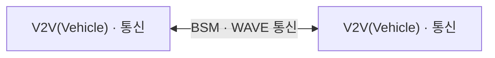

<!-- PDF page: 147 -->

[그림 68] 스마트 교통서비스 분류

| 스마트교통 서비스 분류 | |
| --- | --- |
| V2V(Vehicle) | 차량 ↔ 차량 |
| V2I(Infra) | 차량 → 노변기지국 ↔ 백엔드 서버 |
| V2N(Network) | 백엔드 서버 ↔ 모바일 디바이스 |
| 스마트카 구성요소 분류 | 인포테인먼트 · 통신 · 차체 · 동력 및 샤시 · 진단 및 유지보수 |
| | 3rd party 제품 |

<!-- 생략: 스마트카 장비 아이콘과 복합 연결 배치 -->

〈출처: 스마트교통 사이버 보안 가이드, 과학기술정보통신부, 2018. 5.〉

###### V2V 서비스

V2V 서비스는 교통의 주체인 차량들이 주변의 차량과 무선 통신을 통해 서로 정보를 교환하는 서비스이다. 이 서비스를 통해 차량들은 위치 정보와 교통흐름 정보, 도로 운행 정보 등의 메시지를 송/수신한다. 주요한 서비스로는 노변정보 및 장애물 알림서비스, 도로공사 알림서비스, 교차로 신호정보 알림서비스, 주변차량 정보 알림서비스, 긴급차량 접근 알림서비스 등이 있다.

V2V 서비스

- 노변정보 및 장애물 알림 서비스

- 도로 공사 알림 서비스

- 교차로 신호정보 알림 서비스

- 주변 차량 정보 알림 서비스

- 긴급 차량 접근 알림 서비스

[그림 69] V2V 서비스

###### V2I 서비스

V2I 서비스는 교통의 주체인 차량들과 교통을 지원하는 인프라와의 통신을 의미한다. OBU(On Board Unit)가 장착된 차량이 노변의 기지국과 WAVE(Wireless Access in Vehicular Environments) 통신 혹은 4G LTE/5G 통신을 통해 메시지를 송수신한다. 노변의 기지국은 교통관제 센터 등에 설치된 Back-end 서버와 연결되어 차량에서 전송 받은 차량의 상태정보, 위치정보, 운행 정보를 송수신한다. 센터 시스템은 다수의 차량 및 기지국을 통해 전송 받은 정보들을 취합 및 분석하여 기
