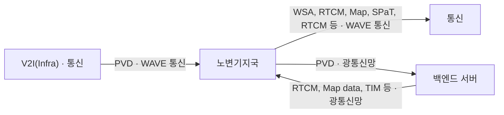

<!-- PDF page: 148 -->

지국에게 통합 교통정보, 도로교통 상황 등을 전송하고 기지국은 다시 차량들에게 전송한다. V2I 서비스의 사례로는 실시간 교통정보 수집 및 제공 서비스, 통행료 징수 서비스, 노변정보 및 장애물 알림 서비스, 도로공사 알림 서비스 보호구역 알림 서비스 등이 있다.

V2I 서비스

- 실시간 교통정보 수집 및 제공

- 통행료 징수 서비스

- 노변정보 및 장애물 알림 서비스

- 도로 공사 알림 서비스

- 교차로 신호정보 알림 서비스

- 보호 구역 알림 서비스

- 보행자 알림 서비스

[그림 70] V2I 서비스

###### V2N 서비스

V2N 서비스는 교통의 주체인 차량이 연결된 네트워크를 통하여 클라우드나 인터넷상의 서버, 모바일 디바이스와 상호 통신을 수행하는 서비스를 의미한다. TCU(Telecommunication Control Unit)는 차량에 장착되어 백엔드 서버와의 통신을 진행하며, 백엔드 서버는 모바일 기기와 통신하여 사용자에게 정보를 제공하고 차량을 제어하는 서비스를 제공한다.

| 텔레매틱스를 통한 서비스 | 3rd party 제품을 통한 서비스 |
| --- | --- |
| • 원격 제어 서비스 • 원격 진단 서비스 • OTA 서비스 • e-Call 서비스 • 모바일 디바이스 연동 서비스 | • 차량 진단 서비스 • 운전자 상태 파악 서비스 • 카 쉐어링 서비스 • 차량 위치 추적 서비스 • 전자 지불 서비스 |

[그림 71] V2N 서비스

<!-- 생략: V2N(Network) 백엔드 서버·모바일 디바이스·통신·진단 및 유지보수·3rd party 제품 간 이동통신망/유선 연결/근거리통신 장비 배치 -->
