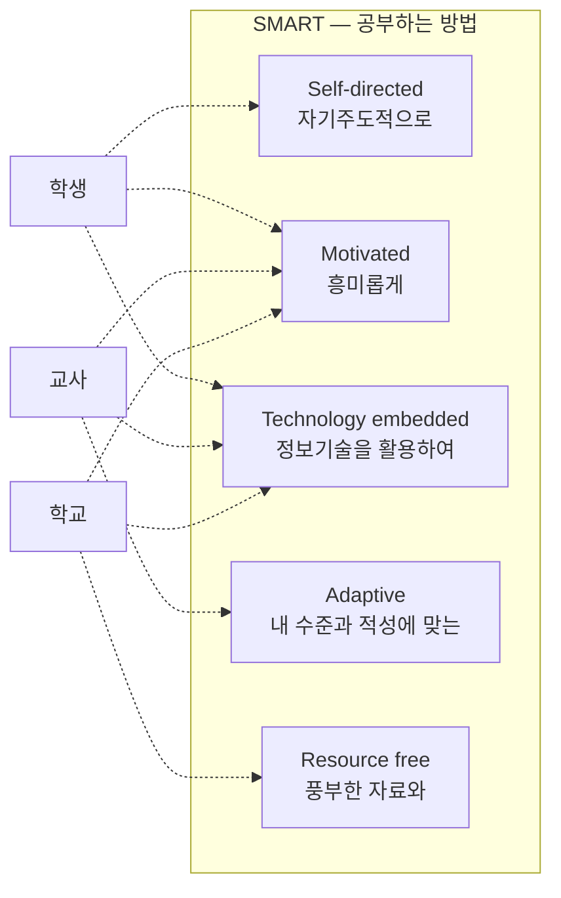

<!-- PDF page: 149 -->

###### 커넥티드 카 서비스

커넥티드 카는 텔레매틱스 기술이 이동통신의 발전과 클라우드 서비스의 확산에 따라 발전하고 있는 자율주행 자동차의 핵심 기술이다. 커넥티드 카는 자동차와 주변환경, 인프라 등의 연결성을 바탕으로 교통정보 서비스, 자동차 내 음악 서비스, 정보 서비스 등의 다양한 서비스를 대중들에게 제공할 수 있다.

커넥티드 카가 제공 가능한 서비스로는 증강현실을 이용한 정보제공 서비스, 전방 도로 상황을 인지하여 안전한 차량 운행을 보조 해주는 서비스와 운전자의 대응이 필요 없는 완전 자율주행과 자동주차 등을 예로 들 수 있다.

##### ⑥ 스마트 교육

첨단 디지털 환경의 발달로 인한 사회의 변화에서 교육환경과 관련한 사항은 비혼족의 증가, 출산율의 지속적인 하락, 개인의 다양성 존중 시대, 급속한 고령화의 진행 등으로 볼 수 있다. 이러한 사회의 변화에 대응하기 위하여 정부는 교육정보화 기본계획과 함께 스마트 교육 추진 전략을 수립하였다.

[그림 72] 스마트 교육 개념도

정부의 스마트교육 추진은 1997년부터 시작된 기초연구를 기반으로 2006년 디지털 교과서 프로토타입이 개발되었으며, 2007년에는 교육부가 국어, 영어, 수학 과목의 교과서를 디지털 교과서로 개발하여 상용화를 논의하였다. 그 후 2011년에 “스마트 교육 추진 전략”을 제안하고 새로운 정책으로 스마트 교육을 진행하고 있다.

##### ⑦ 스마트 교실

스마트 교육에서 프로젝트 빔, TV, 대형 스마트 액정, 전자칠판, 무선인터넷 기기 등을 구비하여 새로운 교육방식을 연구하는 “스마트 교실”은 “디지털 교과서”와 더불어 스마트 교육의 중요 요소이다. 교육의 질을 책임지는 교사들은 다양한 프로그램들을 이용한 수업을 디지털 교실에서 디지털 기기들을 활용하여 진행할 수 있다.

〈표 81〉 스마트교육의 수업방법 및 활용도구

| 수업 방법 | 설명 |
| --- | --- |
| 제작 | 파워포인트, 한글, 구글앱스, 티쳐메이커, 렉토라, e-교과서 저작툴, 무비메이커(동영상 제작), PDF 문서제작, SNS, 에버노트, 프레지(Prezi), 기존 CD 활용 |
| 검색 | 네이버, 구글, IP-TV, 파스텔(fastel), 유튜브 |
| 분석 | 파스텔(fastel), 구글 문서도구 |
| 발표 | 클래스팅, 트위터, 미러링(전체), LMS 솔루션, 구글 문서도구, SNS, 메신저, 전자칠판 |
| 평가 | 파스텔(fastel), 구글 문서도구, 학습 퀴즈 |
