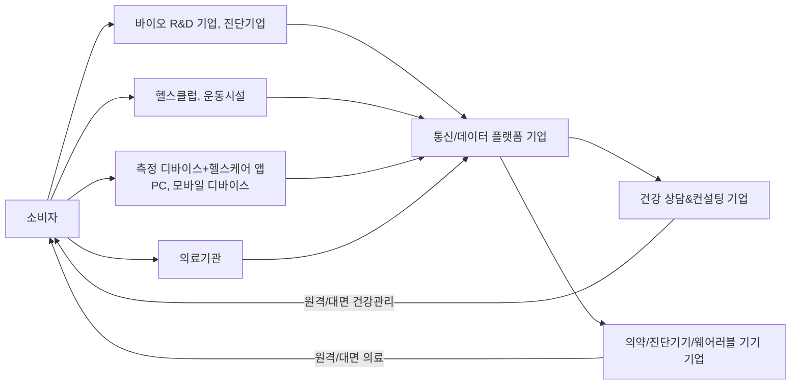

<!-- PDF page: 150 -->

| 수업 방법 | 설명 |
| --- | --- |
| 공유 | 파스텔(fastel), 클래스팅, 구글 문서도구 |
| 커뮤니케이션 | SNS, LMS 메시지 기능, 트위터, 페이스북, 구글 드라이버, 클래스팅, 학급홈페이지 게시판 |

출처: 테크놀로지 기반 연구학교 실태조사 연구, 한국교육학술정보원, 2013.

###### 디지털 교과서

디지털 교과서는 종이 교과서에 있는 내용을 디지털화하고 동영상과 인터랙티브한 기능, 자동채점 기능 등을 추가했다. 예를 들어 액체, 고체, 기체 간의 분자운동의 영상을 보여주거나 스크롤을 움직이면 지구에서부터 우주까지 모습을 관찰하도록 만들었다.

##### ⑧ 스마트 헬스케어

스마트 헬스케어는 디지털 디바이스와 IT 기기를 지칭하는 스마트, 그리고 의료서비스를 지칭하는 헬스케어가 접목된 분야이다. 스마트 헬스케어는 향후 사물인터넷과 클라우드 컴퓨팅, 빅데이터, 인공지능 등 4차 산업혁명의 핵심 기술들과 접목되어 큰 발전을 이룰 것으로 예상된다. 따라서 스마트 헬스케어의 서비스를 재해석해 보면 소비자 혹은 환자의 측정된 데이터가 존재하고, 이를 빅데이터 분석 등의 기법을 활용하여 분석하는 전문기업이 수집 및 분석하고, 이에 대한 결과물을 기반으로 의료기관이 소비자에게 서비스를 제공하는 개념이라고 볼 수 있다.

자문 및 치료 / 데이터 생성 / 데이터 수집·분석

[그림 73] 스마트 헬스케어 구조²⁹

###### 스마트 헬스케어 산업의 성장요인

- 무선이동통신과 모바일 디바이스의 기술진보와 사용자 증가

- 빅데이터를 통한 분석의 중요성 및 초연결 사회로의 진입

- 출산율 하락, 급속한 고령화 사회로의 진입, 새로운 질병과 만성병의 지속적인 증가

- 문화와 경제의 발전으로 인한 의료 서비스 수요 증가

29 출처: ETRI 미래전략연구소
