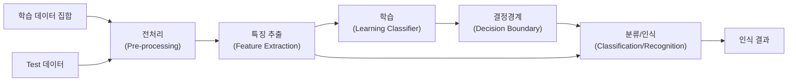

<!-- PDF page: 152 -->

### 03 IT 비즈니스 최신 서비스

#### 가) SW중심 IT 비즈니스 최신 서비스

##### ① 인공지능(AI, Artificial Intelligence)

근래 들어 인공지능을 활용한 서비스가 활발하게 대두되고 있다. 구글 번역, 바이두, 네이버 번역 서비스 등의 번역 서비스는 AI기술 중 인공신경망 알고리즘을 활용하여 대중들이 자신이 사용하지 않는 언어를 번역할 수 있도록 서비스하고 있으며, 카카오의 꽃 검색, 네이버의 스마트 렌즈, 구글 렌즈 등은 대표적인 “머신비전”이라고 통칭되는 AI 이미지 분류 기능을 활용한 서비스이다. 또한, 사용자가 듣고 있는 음악을 판별하여 알려주는 “음악 서비스”, 사진의 워터마크를 지우는 “워터마크 지우기 서비스”, 자신이 그린 그림을 이모티콘처럼 바꿔주는 “오토 드로우” 서비스 등은 AI를 활용하여 생활 속에서 활용 가능한 서비스이다.

인공지능이란 존 매카시(John McCarthy)가 1956년 미국 Dartmouth 학술회의에서 “기계를 인간 행동의 지식에서와 같이 행동하게 만드는 것”이라고 주장한 개념을 초기 개념으로 볼 수 있다. 현재 인공지능의 개념은 컴퓨터나 시스템 등이 인간의 지능(인지/추론/학습 등)을 따라서 수행하도록 만드는 방법론 혹은 실현가능성 등을 연구하는 기술이라고 본다.

###### 인공지능 기술

인공지능 기술은 일반성, 방대성, 부정확성, 지식 이용 등과 함께 추론의 기능도 특징으로 가지고 있으며, 최근 대표적인 인공지능 기술로는 “패턴 인식”, “머신 러닝(기계학습)”, “딥 러닝” 등이 있다.

###### 패턴 인식(Pattern Recognition)

인공지능에서 패턴 인식은 입력된 값을 기반으로 한 기준에 의하여 학습 데이터 집합을 다수 그룹으로 분류하는 것을 뜻한다. 패턴 인식은 학습의 단계와 인식의 두가지 단계가 존재한다.

학습 단계는 패턴들을 구분할 수 있는 핵심 정보를 추출한다. 이를 위해 주어진 데이터 집합을 활용하여 패턴의 특성을 분석한다.

학습에서 발견된 패턴들의 핵심 정보를 이용하여 인식 단계에서는 주어진 데이터를 기인식된 패턴으로 분류하고 인식한다.

[그림 75] 패턴 인식 과정³⁰

30 출처: 박혜영, 이관용, “패턴 인식과 기계학습”
