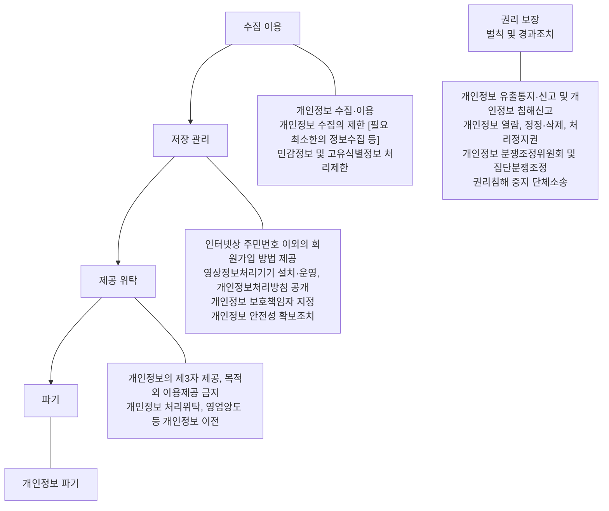

<!-- PDF page: 179 -->

##### ① 개인정보 처리절차

개인정보보호법에서 규정하고 있는 개인정보 처리단계별 의무사항은 [그림 79]과 같다.

처리단계 / 개인정보보호법령 규정

[그림 79] 개인정보 처리 절차

개인정보처리시스템을 기획, 개발·구축하려는 경우 다음과 같은 개인정보보호 수칙을 준수하여 개발하여야 한다.

국가에서는 기업이나 공공기관이 개인정보를 수집하거나 제3자에게 제공하고자 할 때 고객으로부터 받는 동의서의 가이드라인을 제공하고 있다.⁴³

기업은 수집하고자 하는 개인정보의 항목과 목적, 보유기간, 민감정보 처리내역, 제3자 제공내역, 동의 거부권의 내용 등을 가이드라인에 기초하여, 이용자가 한눈에 알아볼 수 있게 정리해서 제공해야한다.

43 개인정보보호종합지원포털, '개인정보 수집·제공 동의서 가이드라인'
