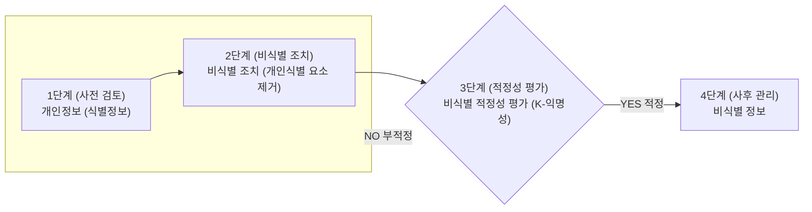

<!-- PDF page: 186 -->

그 자체로 특정 개인을 알아볼 수 있는 정보 (다른 정보와 쉽게 결합하여 특정 개인을 알아볼 수 있는 정보 포함)

개인정보가 아닌 것으로 추정 (단, 다른 정보와 결합하여 재식별되지 않도록 필수적인 관리조치는 이행)

[그림 85] 개인정보 비식별화 단계

- 식별자 조치 기준: 정보집합물에 포함된 식별자는 원칙적으로 삭제 조치. 다만, 데이터 이용 목적상 반드시 필요한 식별자는 비식별 조치 후 활용

〈예시〉 속성자

| 개인 특성 | • 성별, 연령(나이), 국적, 고향, 시·군·구명, 우편번호 병역여부, 결혼여부, 종교, 취미, 동호회·클럽 등 • 흡연여부, 음주여부, 채식여부, 관심사항 등 |
|---|---|
| 신체 특성 | • 혈액형, 신장, 몸무게, 허리둘레, 혈압, 눈동자 색깔 등 • 신체검사 결과, 장애유형, 장애등급 등 • 병명, 상병(傷病)코드, 투약코드, 진료내역 등 |
| 신용 특성 | • 세금 납부액, 신용등급, 기부금 등 • 건강보험료 납부액, 소득분위, 의료 급여자 등 |
| 경력 특성 | • 학교명, 학과명, 학년, 성적, 학력 등 • 경력, 직업, 직종, 직장명, 부서명, 직급, 전 직장명 등 |
| 전자적 특성 | • 쿠키정보, 접속일시, 방문일시, 서비스 이용 기록, 접속로그 등 • 인터넷 접속기록, 휴대전화 사용기록, GPS 데이터 등 |
| 가족 특성 | • 배우자·자녀·부모·형제 등 가족 정보, 법정대리인 정보 등 |

[그림 86] 개인정보 예시 식별자

- 속성자 조치 기준: 정보집합물에 포함된 속성자도 데이터 이용 목적과 관련이 없는 경우에는 원칙적으로 삭제. 희귀병명, 희귀경력 등의 속성자는 구체적인 상황에 따라 개인 식별 가능성이 매우 높으므로 엄격한 비식별 조치 필요
