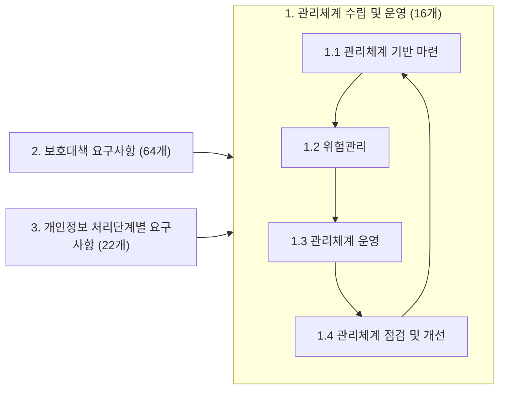

<!-- PDF page: 189 -->

또한 의무대상자 기준에는 해당하지 않으나 자발적으로 정보보호 및 개인정보보호 관리체계를 구축·운영하는 기업·기관은 임의신청자로 분류되어 자율적으로 신청하여 인증심사를 받을 수 있다.

기관 및 기업이 개인정보보호 관리체계를 갖추고 체계적·지속적으로 보호 업무를 수행하는지에 대해 객관적으로 심사하여 기준 만족 시 인증을 부여합니다.

**1. 관리체계 수립 및 운영 (16개)**

| 2. 보호대책 요구사항(64개) | 3. 개인정보 처리단계별 요구사항(22개) |
|---|---|
| 2.1 정책, 조직, 자산관리 2.2 인적보안 2.3 외부자 보안 2.4 물리 보안 2.5 인증 및 권한관리 2.6 접근통제 2.7 암호화 적용 2.8 정보시스템 도입 및 개발보안 2.9 시스템 및 서비스 운영관리 2.10 시스템 및 서비스 보안관리 2.11 사고 예방 및 대응 2.12 재해복구 | 3.1 개인정보 수집 시 보호조치 3.2 개인정보 보유 및 이용 시 보호조치 3.3 개인정보 제공 시 보호조치 3.4 개인정보 파기 시 보호조치 3.5 정보주체 권리보호 |

[그림 90] 개인정보보호 관리체계

#### 나) 개인정보처리자 사후 대응 방안

##### ① 개인정보 유출 대응

개인정보가 유출된 경우(1천 명 이상인 경우에는 필수의무사항-개인정보보호법 제34조 동법 시행령 제39조) 정보주체에게 즉시 알리고, 사실확인, 홈페이지 차단, 비밀번호변경 공지 등 초동 조치를 신속히 해야 한다.
또한 유출 피해자는 분쟁조정위원회에 집단분쟁조정 또는 법원에 권리침해단체소송을 제기할 수 있으므로 철저히 대비하도록 한다.

##### ② 개인정보 유출 통지

일정 규모 이상의 개인정보가 유출된 경우 행정안전부와 한국인터넷진흥원(KISA) 등 전문기관에 신고하여 피해 확산 방지 및 복구 기술을 지원받도록 되어있다.

〈표 103〉 개인정보 유출 통지

| 신고대상 | 1천 명 이상의 정보주체에 관한 개인정보가 유출된 경우 |
|---|---|
| 신고시기 | 5일 이내(정보주체에 대한 통지 및 조치결과 신고) |
| 신고방법 | 1) 전자우편, 팩스, 인터넷 사이트를 통해 유출사고 신고 및 신고서 제출 2) 시간적 여유가 없거나 특별한 사정이 있는 경우: 전화를 통하여 통지내용을 신고한 후, 유출신고서를 제출할 수 있음 |
| 신고내용 | 기관명, 통지여부, 유출된 개인정보 항목·규모, 유출 시점·경위, 유출피해 최소화 대책·조치 및 결과, 정보주체가 할 수 있는 피해 최소화 방법 및 구제절차, 담당부서·담당자 연락처 등 |
